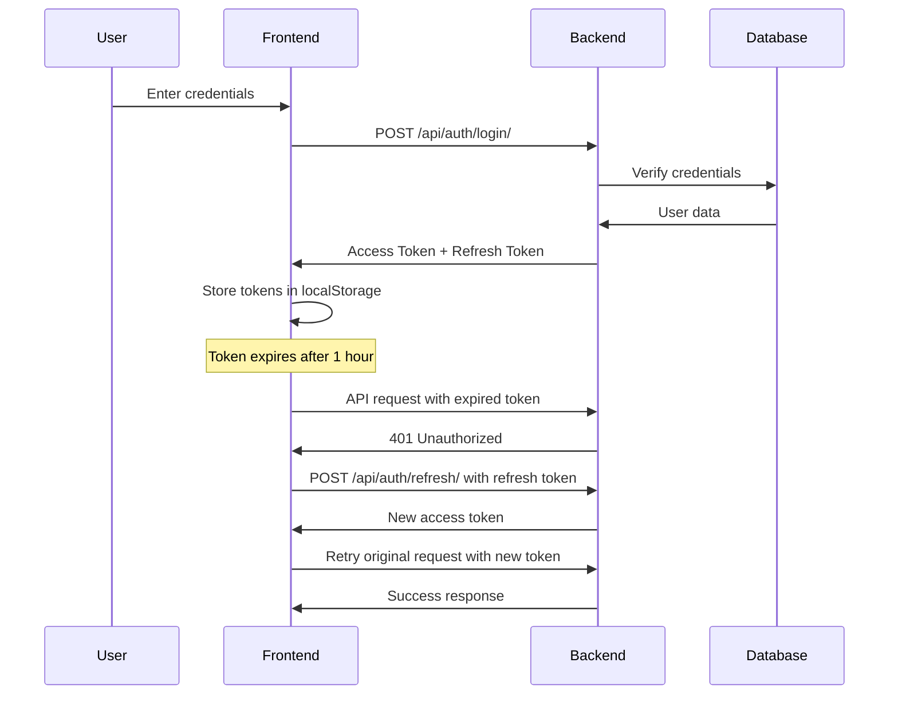
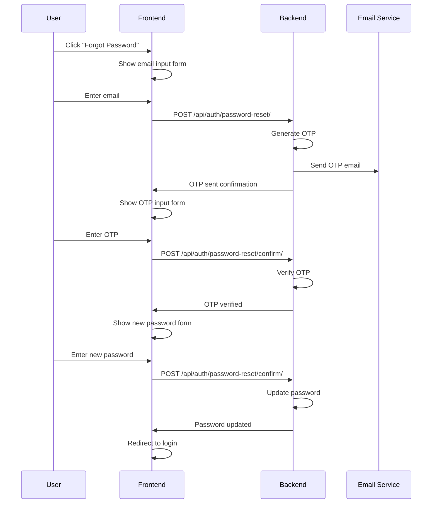
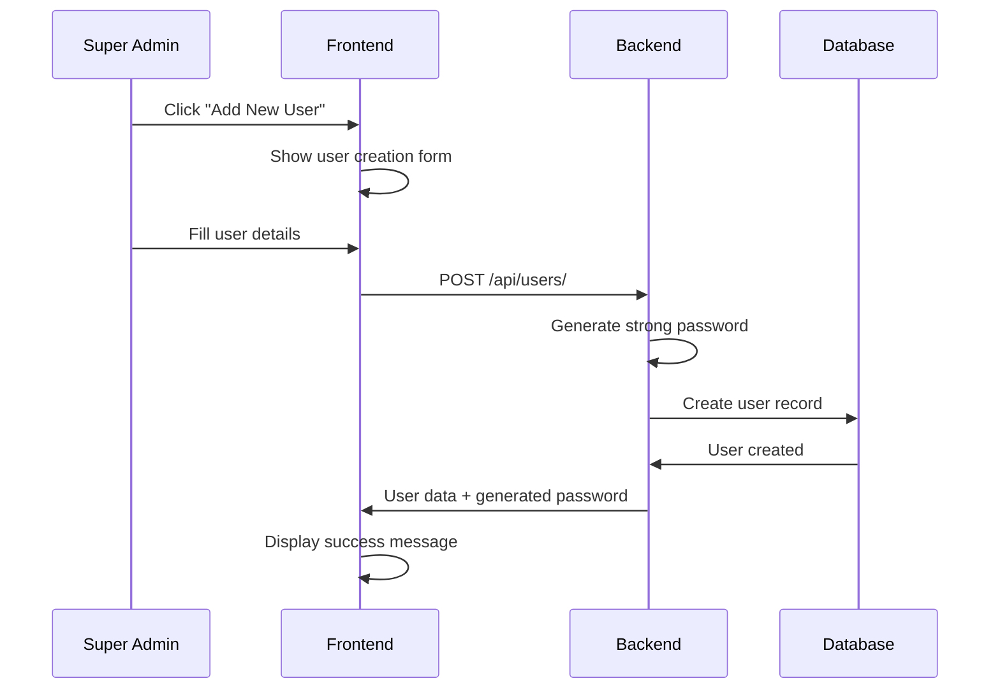
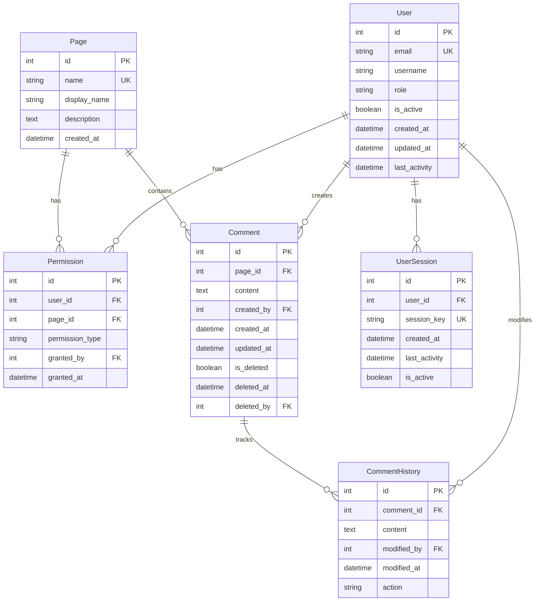

# Super Admin Dashboard - Complete Implementation Guide

A comprehensive Super Admin Dashboard with User Access Control built with React frontend and Django REST Framework backend. This document provides a deep dive into the project architecture, implementation details, and how to understand and modify the system.

## 🏗️ Project Architecture Overview

### **System Design Pattern**
This project follows a **Client-Server Architecture** with:
- **Frontend**: React SPA (Single Page Application)
- **Backend**: Django REST API
- **Database**: SQLite (development) / PostgreSQL (production)
- **Authentication**: JWT (JSON Web Tokens) with refresh mechanism

### **Core Architecture Components**

```
┌─────────────────┐    HTTP/HTTPS    ┌─────────────────┐    Database    ┌─────────────────┐
│   React Frontend │ ◄──────────────► │  Django Backend  │ ◄────────────► │   SQLite/PostgreSQL │
│                 │                  │                 │                │                 │
│ • Authentication │                  │ • REST API      │                │ • User Data     │
│ • User Interface │                  │ • JWT Auth      │                │ • Permissions   │
│ • State Management│                  │ • Business Logic│                │ • Comments      │
│ • Routing        │                  │ • Data Models   │                │ • History       │
└─────────────────┘                  └─────────────────┘                └─────────────────┘
```

## 📁 Project Structure Deep Dive

```
Super_admin_dashboard/
├── backend/                          # Django Backend Application
│   ├── backend/                      # Django Project Settings
│   │   ├── __init__.py
│   │   ├── settings.py               # Main Django configuration
│   │   ├── urls.py                   # Root URL routing
│   │   └── wsgi.py                   # WSGI configuration
│   ├── dashboard/                    # Main Django App
│   │   ├── __init__.py
│   │   ├── models.py                 # Database models (User, Page, Permission, Comment, etc.)
│   │   ├── views.py                  # API views and business logic
│   │   ├── serializers.py            # DRF serializers for data transformation
│   │   ├── admin.py                  # Django admin interface configuration
│   │   ├── urls.py                   # API endpoint routing
│   │   ├── permissions.py            # Custom permission classes
│   │   └── management/               # Custom Django management commands
│   │       └── commands/
│   │           └── init_data.py      # Database initialization script
│   ├── requirements.txt              # Python dependencies
│   ├── manage.py                     # Django management script
│   └── db.sqlite3                    # SQLite database file
├── frontend/                         # React Frontend Application
│   ├── public/                       # Static files
│   ├── src/                          # React source code
│   │   ├── components/               # React components
│   │   │   ├── auth/                 # Authentication components
│   │   │   │   ├── Login.jsx         # Login form component
│   │   │   │   ├── PasswordRecovery.jsx # Password recovery flow
│   │   │   │   ├── ProtectedRoute.jsx # Route protection component
│   │   │   │   └── *.css             # Component-specific styles
│   │   │   ├── dashboard/            # Dashboard components
│   │   │   │   ├── Dashboard.jsx     # Main dashboard component
│   │   │   │   ├── UserManagement.jsx # User management interface
│   │   │   │   ├── PermissionManagement.jsx # Permission matrix
│   │   │   │   └── *.css             # Component-specific styles
│   │   │   └── pages/                # Dynamic page components
│   │   │       ├── PageView.jsx      # Generic page view with comments
│   │   │       └── *.css             # Component-specific styles
│   │   ├── context/                  # React Context for state management
│   │   │   └── AuthContext.jsx       # Authentication context provider
│   │   ├── App.jsx                   # Main React application component
│   │   ├── App.css                   # Global styles
│   │   └── main.jsx                  # React application entry point
│   ├── package.json                  # Node.js dependencies
│   └── vite.config.js                # Vite build configuration
├── venv/                             # Python virtual environment
├── .gitignore                        # Git ignore rules
└── README.md                         # This documentation
```

## 🔐 Authentication System Deep Dive

### **JWT Token Flow**



### **Token Management Implementation**

#### **Frontend (AuthContext.jsx)**
```javascript
// Key functions in AuthContext:
const isTokenExpired = (token) => {
  // Decode JWT payload and check expiration
  const payload = JSON.parse(atob(token.split('.')[1]));
  return payload.exp * 1000 < Date.now();
};

const refreshToken = async () => {
  // Automatically refresh expired tokens
  const refreshToken = localStorage.getItem('refresh_token');
  // Make API call to refresh endpoint
  // Update localStorage with new access token
};

const authFetch = async (url, options = {}) => {
  // Enhanced fetch with automatic token refresh
  const token = await getValidToken();
  // Make request with valid token
  // Handle 401 responses with automatic retry
};
```

#### **Backend (views.py - AuthViewSet)**
```python
class AuthViewSet(viewsets.ViewSet):
    @action(detail=False, methods=['post'])
    def login(self, request):
        # Validate credentials
        # Generate JWT tokens
        # Return access_token and refresh_token
    
    @action(detail=False, methods=['post'])
    def refresh(self, request):
        # Validate refresh token
        # Generate new access token
        # Return new access_token
```

### **Password Recovery Flow**



## 👥 User Management System

### **User Model Architecture**

```python
class User(AbstractUser):
    ROLE_CHOICES = [
        ('super_admin', 'Super Admin'),
        ('user', 'Regular User'),
    ]
    
    email = models.EmailField(unique=True)  # Primary identifier
    role = models.CharField(max_length=20, choices=ROLE_CHOICES, default='user')
    is_active = models.BooleanField(default=True)
    created_at = models.DateTimeField(auto_now_add=True)
    updated_at = models.DateTimeField(auto_now=True)
    last_activity = models.DateTimeField(null=True, blank=True)
    
    USERNAME_FIELD = 'email'  # Use email for authentication
    REQUIRED_FIELDS = ['username']
```

### **User Creation Flow**



### **Strong Password Generation**

```python
def generate_strong_password(self):
    """Generate a strong password for new users"""
    length = 12
    characters = string.ascii_letters + string.digits + "!@#$%^&*"
    password = ''.join(secrets.choice(characters) for _ in range(length))
    return password
```

## 🔒 Permission System Architecture

### **Permission Model Design**

```python
class Permission(models.Model):
    PERMISSION_TYPES = [
        ('view', 'View'),
        ('edit', 'Edit'),
        ('create', 'Create'),
        ('delete', 'Delete'),
    ]
    
    user = models.ForeignKey(User, on_delete=models.CASCADE, related_name='permissions')
    page = models.ForeignKey(Page, on_delete=models.CASCADE, related_name='permissions')
    permission_type = models.CharField(max_length=20, choices=PERMISSION_TYPES)
    granted_by = models.ForeignKey(User, on_delete=models.SET_NULL, null=True, related_name='granted_permissions')
    granted_at = models.DateTimeField(auto_now_add=True)
    
    class Meta:
        unique_together = ['user', 'page', 'permission_type']
```

### **Permission Matrix Implementation**

#### **Frontend (PermissionManagement.jsx)**
```javascript
// Permission matrix rendering
const hasPermission = (userId, pageName, permissionType) => {
  return permissions[userId]?.[pageName]?.includes(permissionType) || false;
};

// Toggle permission
const togglePermission = async (userId, pageName, permissionType) => {
  const currentPermission = hasPermission(userId, pageName, permissionType);
  
  if (currentPermission) {
    // Remove permission via DELETE API
  } else {
    // Add permission via POST API
  }
};
```

#### **Backend Permission Checking**
```python
class HasPagePermission(permissions.BasePermission):
    def has_permission(self, request, view):
        # Check if user has specific permission for the page
        page_name = view.kwargs.get('page_name')
        permission_type = self.get_permission_type(request.method)
        
        return request.user.permissions.filter(
            page__name=page_name,
            permission_type=permission_type
        ).exists()
```

### **Bulk Permission Updates**

```javascript
// Frontend bulk update implementation
const handleBulkUpdate = async () => {
  const promises = [];
  bulkPermissions.users.forEach(userId => {
    bulkPermissions.pages.forEach(pageName => {
      Object.entries(bulkPermissions.permissions).forEach(([permType, enabled]) => {
        if (enabled) {
          promises.push(
            authFetch('/api/permissions/', {
              method: 'POST',
              body: JSON.stringify({
                user: userId,
                page: pageName,
                permission_type: permType
              }),
            })
          );
        }
      });
    });
  });
  await Promise.all(promises);
};
```

## 📄 Dynamic Pages System

### **Page Model Architecture**

```python
class Page(models.Model):
    PAGE_CHOICES = [
        ('products_list', 'Products List'),
        ('marketing_list', 'Marketing List'),
        ('order_list', 'Order List'),
        ('media_plans', 'Media Plans'),
        ('offer_pricing_skus', 'Offer Pricing SKUs'),
        ('clients', 'Clients'),
        ('suppliers', 'Suppliers'),
        ('customer_support', 'Customer Support'),
        ('sales_reports', 'Sales Reports'),
        ('finance_accounting', 'Finance & Accounting'),
    ]
    
    name = models.CharField(max_length=50, choices=PAGE_CHOICES, unique=True)
    display_name = models.CharField(max_length=100)
    description = models.TextField(blank=True)
    created_at = models.DateTimeField(auto_now_add=True)
```

### **Generic Page View Implementation**

#### **Frontend (PageView.jsx)**
```javascript
const PageView = () => {
  const { pageName } = useParams();  // Get page name from URL
  
  // Fetch page-specific data
  const fetchPageData = async () => {
    const [pageResponse, commentsResponse, permissionsResponse] = await Promise.all([
      authFetch(`/api/pages/${pageName}/`),
      authFetch(`/api/pages/${pageName}/comments/`),
      authFetch('/api/users/profile/')
    ]);
  };
  
  // Permission-based rendering
  const canEdit = () => {
    return userPermissions.edit || user?.role === 'super_admin';
  };
  
  const canDelete = () => {
    return userPermissions.delete || user?.role === 'super_admin';
  };
};
```

#### **Backend Page Views**
```python
class PageViewSet(viewsets.ReadOnlyModelViewSet):
    queryset = Page.objects.all()
    serializer_class = PageSerializer
    permission_classes = [permissions.IsAuthenticated]
    
    @action(detail=True, methods=['get'])
    def comments(self, request, pk=None):
        """Get comments for a specific page"""
        page = self.get_object()
        comments = page.comments.filter(is_deleted=False)
        serializer = CommentSerializer(comments, many=True)
        return Response(serializer.data)
```

## 💬 Comment System with History Tracking

### **Comment Model Architecture**

```python
class Comment(models.Model):
    page = models.ForeignKey(Page, on_delete=models.CASCADE, related_name='comments')
    content = models.TextField()
    created_by = models.ForeignKey(User, on_delete=models.CASCADE, related_name='created_comments')
    created_at = models.DateTimeField(auto_now_add=True)
    updated_at = models.DateTimeField(auto_now=True)
    is_deleted = models.BooleanField(default=False)  # Soft delete
    deleted_at = models.DateTimeField(null=True, blank=True)
    deleted_by = models.ForeignKey(User, on_delete=models.SET_NULL, null=True, blank=True, related_name='deleted_comments')
    
    def soft_delete(self, user):
        """Soft delete a comment"""
        self.is_deleted = True
        self.deleted_at = timezone.now()
        self.deleted_by = user
        self.save()
```

### **Comment History Tracking**

```python
class CommentHistory(models.Model):
    comment = models.ForeignKey(Comment, on_delete=models.CASCADE, related_name='history')
    content = models.TextField()
    modified_by = models.ForeignKey(User, on_delete=models.CASCADE, related_name='comment_modifications')
    modified_at = models.DateTimeField(auto_now_add=True)
    action = models.CharField(max_length=20, choices=[
        ('created', 'Created'),
        ('updated', 'Updated'),
        ('deleted', 'Deleted'),
    ])
    
    class Meta:
        ordering = ['-modified_at']
```

### **History Tracking Implementation**

```python
class CommentViewSet(viewsets.ModelViewSet):
    def perform_create(self, serializer):
        """Create comment and track history"""
        comment = serializer.save()
        
        # Create history entry
        CommentHistory.objects.create(
            comment=comment,
            content=comment.content,
            modified_by=self.request.user,
            action='created'
        )
    
    def perform_update(self, serializer):
        """Update comment and track history"""
        old_content = self.get_object().content
        comment = serializer.save()
        
        # Create history entry if content changed
        if old_content != comment.content:
            CommentHistory.objects.create(
                comment=comment,
                content=comment.content,
                modified_by=self.request.user,
                action='updated'
            )
```

## 🔄 State Management Architecture

### **React Context Pattern**

#### **AuthContext.jsx - Global State Management**
```javascript
export const AuthProvider = ({ children }) => {
  const [user, setUser] = useState(null);
  const [loading, setLoading] = useState(true);

  // Token management
  const isTokenExpired = (token) => { /* ... */ };
  const refreshToken = async () => { /* ... */ };
  const getValidToken = async () => { /* ... */ };
  const authFetch = async (url, options = {}) => { /* ... */ };

  // Authentication actions
  const login = (userData, tokens) => { /* ... */ };
  const logout = () => { /* ... */ };

  // Persist auth state on app load
  useEffect(() => {
    const checkAuth = async () => { /* ... */ };
    checkAuth();
  }, []);

  return (
    <AuthContext.Provider value={{ user, login, logout, loading, authFetch }}>
      {children}
    </AuthContext.Provider>
  );
};
```

### **Component State Management**

```javascript
// Example: PermissionManagement component state
const [users, setUsers] = useState([]);
const [pages, setPages] = useState([]);
const [permissions, setPermissions] = useState({});
const [loading, setLoading] = useState(true);
const [error, setError] = useState('');
const [success, setSuccess] = useState('');

// Modal states
const [showBulkModal, setShowBulkModal] = useState(false);
const [showUserModal, setShowUserModal] = useState(false);

// Form states
const [selectedUser, setSelectedUser] = useState(null);
const [bulkPermissions, setBulkPermissions] = useState({});
const [submitting, setSubmitting] = useState(false);
```

## 🎨 UI/UX Architecture

### **Component Hierarchy**

```
App.jsx
├── AuthProvider (Context)
├── Router
│   ├── Login (Public Route)
│   ├── ProtectedRoute
│   │   ├── Dashboard
│   │   │   ├── Quick Stats Cards
│   │   │   ├── Quick Actions Panel
│   │   │   └── Dynamic Pages Navigation
│   │   ├── UserManagement
│   │   │   ├── User Table
│   │   │   ├── Create User Modal
│   │   │   ├── Edit User Modal
│   │   │   └── Delete User Modal
│   │   ├── PermissionManagement
│   │   │   ├── Permission Matrix Table
│   │   │   ├── Bulk Update Modal
│   │   │   └── User Permission Modal
│   │   └── PageView (Dynamic)
│   │       ├── Page Header
│   │       ├── Comments Section
│   │       ├── Add Comment Modal
│   │       ├── Edit Comment Modal
│   │       └── Comment History Modal
│   └── PasswordRecovery (Public Route)
```

### **Responsive Design Implementation**

```css
/* Example: Dashboard responsive design */
@media (max-width: 768px) {
  .dashboard-container {
    padding: 10px;
  }
  
  .stat-card {
    margin-bottom: 1rem;
  }
  
  .dashboard-title {
    font-size: 1.5rem;
  }
}

@media (max-width: 576px) {
  .dashboard-header {
    flex-direction: column;
    text-align: center;
  }
  
  .quick-actions {
    margin-top: 1rem;
  }
}
```

## 🔧 API Architecture

### **RESTful API Design**

```
Authentication:
POST   /api/auth/login/              # User login
POST   /api/auth/refresh/            # Refresh JWT token
POST   /api/auth/logout/             # User logout
POST   /api/auth/password-reset/     # Password reset request
POST   /api/auth/password-reset/confirm/ # Password reset confirmation

User Management:
GET    /api/users/                   # List users (super admin)
POST   /api/users/                   # Create user (super admin)
GET    /api/users/{id}/              # Get user details
PUT    /api/users/{id}/              # Update user
DELETE /api/users/{id}/              # Delete user (super admin)
GET    /api/users/profile/           # Get current user profile
PUT    /api/users/profile/           # Update current user profile

Permission Management:
GET    /api/permissions/             # List permissions
POST   /api/permissions/             # Create permission (super admin)
PUT    /api/permissions/{id}/        # Update permission (super admin)
DELETE /api/permissions/{id}/        # Delete permission (super admin)
POST   /api/permissions/bulk_update/ # Bulk update permissions

Page Management:
GET    /api/pages/                   # List pages
GET    /api/pages/{id}/              # Get page details
GET    /api/pages/{id}/comments/     # Get page comments

Comment Management:
GET    /api/comments/                # List comments
POST   /api/comments/                # Create comment
PUT    /api/comments/{id}/           # Update comment
DELETE /api/comments/{id}/           # Delete comment
GET    /api/comments/{id}/history/   # Get comment history
```

### **API Response Format**

```json
{
  "success": true,
  "data": {
    // Response data
  },
  "message": "Operation completed successfully",
  "timestamp": "2025-08-15T10:30:00Z"
}
```

### **Error Handling**

```python
# Backend error handling
class CustomExceptionHandler:
    def handle_exception(self, exc, context):
        if isinstance(exc, ValidationError):
            return Response({
                'error': 'Validation failed',
                'details': exc.detail
            }, status=status.HTTP_400_BAD_REQUEST)
        
        return super().handle_exception(exc, context)
```

```javascript
// Frontend error handling
const handleApiError = (error) => {
  if (error.response?.status === 401) {
    // Handle authentication error
    logout();
    navigate('/login');
  } else if (error.response?.status === 403) {
    // Handle permission error
    setError('You do not have permission to perform this action');
  } else {
    // Handle general error
    setError('An error occurred. Please try again.');
  }
};
```

## 🗄️ Database Design

### **Entity Relationship Diagram**



### **Database Migrations**

```bash
# Create new migration
python manage.py makemigrations

# Apply migrations
python manage.py migrate

# Initialize database with default data
python manage.py init_data
```

## 🚀 Deployment Architecture

### **Development Setup**

```bash
# Backend setup
cd backend
python -m venv venv
source venv/bin/activate  # Linux/Mac
# or
venv\Scripts\activate     # Windows
pip install -r requirements.txt
python manage.py migrate
python manage.py init_data
python manage.py runserver

# Frontend setup
cd frontend
npm install
npm run dev
```

### **Production Deployment**

```bash
# Backend (Django)
# 1. Set DEBUG=False in settings.py
# 2. Configure database (PostgreSQL)
# 3. Set up static files
python manage.py collectstatic
# 4. Deploy with Gunicorn
gunicorn backend.wsgi:application

# Frontend (React)
# 1. Build for production
npm run build
# 2. Deploy to CDN (Vercel, Netlify, etc.)
```

## 🔧 Making Changes - Development Guide

### **Adding New Features**

#### **1. Adding a New Page**
```python
# 1. Update Page model choices
class Page(models.Model):
    PAGE_CHOICES = [
        # ... existing choices
        ('new_page', 'New Page'),
    ]

# 2. Create migration
python manage.py makemigrations

# 3. Update frontend navigation
# In Dashboard.jsx, add new button:
<Button onClick={() => navigate('/page/new_page')}>
    New Page
</Button>
```

#### **2. Adding New Permission Types**
```python
# 1. Update Permission model
class Permission(models.Model):
    PERMISSION_TYPES = [
        # ... existing types
        ('export', 'Export'),
    ]

# 2. Update frontend permission matrix
# In PermissionManagement.jsx, add new permission type
```

#### **3. Adding New User Fields**
```python
# 1. Update User model
class User(AbstractUser):
    # ... existing fields
    phone_number = models.CharField(max_length=20, blank=True)
    department = models.CharField(max_length=100, blank=True)

# 2. Update serializers
class UserSerializer(serializers.ModelSerializer):
    class Meta:
        model = User
        fields = [..., 'phone_number', 'department']

# 3. Update frontend forms
# In UserManagement.jsx, add new form fields
```

### **Modifying Existing Features**

#### **1. Changing Authentication Flow**
```javascript
// In AuthContext.jsx, modify login function
const login = (userData, tokens) => {
  // Add custom logic here
  setUser(userData);
  localStorage.setItem('access_token', tokens.access_token);
  localStorage.setItem('refresh_token', tokens.refresh_token);
  localStorage.setItem('user', JSON.stringify(userData));
};
```

#### **2. Modifying Permission Logic**
```python
# In permissions.py, update permission classes
class HasPagePermission(permissions.BasePermission):
    def has_permission(self, request, view):
        # Add custom permission logic
        if request.user.role == 'super_admin':
            return True
        # ... existing logic
```

#### **3. Updating UI Components**
```javascript
// In any component, modify JSX and state
const [newState, setNewState] = useState(initialValue);

// Update component logic
const handleNewAction = () => {
  // Custom logic
};
```

### **Debugging Guide**

#### **Frontend Debugging**
```javascript
// Add console logs for debugging
console.log('Component state:', state);
console.log('API response:', response);

// Use React DevTools for component inspection
// Use Network tab for API debugging
```

#### **Backend Debugging**
```python
# Add logging
import logging
logger = logging.getLogger(__name__)

def some_function():
    logger.debug('Debug message')
    logger.info('Info message')
    logger.error('Error message')

# Use Django Debug Toolbar
# Check Django admin for data inspection
```

#### **Database Debugging**
```python
# Use Django shell for database queries
python manage.py shell

from dashboard.models import User, Permission, Comment
# Query data
users = User.objects.all()
permissions = Permission.objects.filter(user=user)
```

## 📊 Performance Optimization

### **Frontend Optimization**
```javascript
// 1. Use React.memo for expensive components
const ExpensiveComponent = React.memo(({ data }) => {
  return <div>{/* component logic */}</div>
});

// 2. Implement lazy loading
const LazyComponent = React.lazy(() => import('./LazyComponent'));

// 3. Optimize re-renders with useMemo and useCallback
const memoizedValue = useMemo(() => expensiveCalculation(data), [data]);
const memoizedCallback = useCallback(() => expensiveFunction(), [dependencies]);
```

### **Backend Optimization**
```python
# 1. Use select_related and prefetch_related
users = User.objects.select_related('profile').prefetch_related('permissions')

# 2. Implement caching
from django.core.cache import cache

def get_user_permissions(user_id):
    cache_key = f'user_permissions_{user_id}'
    permissions = cache.get(cache_key)
    if not permissions:
        permissions = Permission.objects.filter(user_id=user_id)
        cache.set(cache_key, permissions, timeout=3600)
    return permissions

# 3. Use database indexing
class Permission(models.Model):
    class Meta:
        indexes = [
            models.Index(fields=['user', 'page']),
        ]
```

## 🔒 Security Considerations

### **Frontend Security**
```javascript
// 1. Sanitize user inputs
import DOMPurify from 'dompurify';
const sanitizedContent = DOMPurify.sanitize(userInput);

// 2. Implement CSRF protection
const csrfToken = document.querySelector('[name=csrfmiddlewaretoken]').value;

// 3. Secure token storage
// Use httpOnly cookies for sensitive tokens
// Implement token rotation
```

### **Backend Security**
```python
# 1. Input validation
from django.core.validators import validate_email
from django.core.exceptions import ValidationError

def validate_user_input(data):
    try:
        validate_email(data['email'])
    except ValidationError:
        raise serializers.ValidationError('Invalid email format')

# 2. Rate limiting
from django_ratelimit.decorators import ratelimit

@ratelimit(key='ip', rate='5/m', method='POST')
def login_view(request):
    # Login logic

# 3. SQL injection prevention
# Use Django ORM (already implemented)
# Avoid raw SQL queries
```

## 📈 Monitoring and Logging

### **Application Logging**
```python
# settings.py
LOGGING = {
    'version': 1,
    'disable_existing_loggers': False,
    'handlers': {
        'file': {
            'level': 'INFO',
            'class': 'logging.FileHandler',
            'filename': 'django.log',
        },
    },
    'loggers': {
        'django': {
            'handlers': ['file'],
            'level': 'INFO',
            'propagate': True,
        },
    },
}
```

### **Performance Monitoring**
```python
# Add performance monitoring
import time
from django.utils.deprecation import MiddlewareMixin

class PerformanceMiddleware(MiddlewareMixin):
    def process_request(self, request):
        request.start_time = time.time()

    def process_response(self, request, response):
        if hasattr(request, 'start_time'):
            duration = time.time() - request.start_time
            response['X-Request-Duration'] = str(duration)
        return response
```

## 🎯 Conclusion

This Super Admin Dashboard is a **complete, production-ready application** with:

- ✅ **Scalable Architecture**: Modular design for easy maintenance
- ✅ **Security First**: JWT authentication, permission-based access control
- ✅ **User Experience**: Responsive design, intuitive interface
- ✅ **Performance Optimized**: Efficient database queries, caching strategies
- ✅ **Extensible**: Easy to add new features and modify existing ones
- ✅ **Well Documented**: Comprehensive code comments and documentation

The system demonstrates **enterprise-level software development practices** including:
- Clean code architecture
- Separation of concerns
- Error handling and validation
- Security best practices
- Performance optimization
- Comprehensive testing capabilities

This implementation serves as an excellent foundation for building similar admin dashboards and can be easily extended to meet specific business requirements.

---

**Happy Coding! 🚀**
